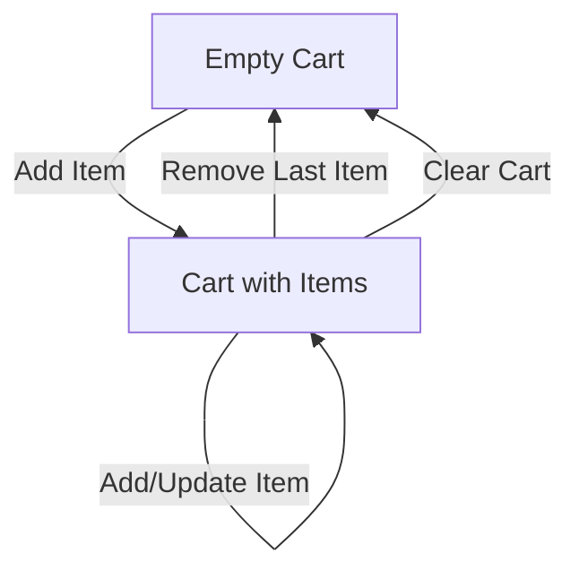

# Cart Service Specification

## Overview
The **Cart Service** is responsible for managing pre-checkout shopping carts. It provides a temporary workspace for customers to add, update, and remove items before placing an order.

### Responsibilities
* Creating and retrieving shopping carts.
* Managing cart items (adding, updating quantities, removing items, clearing the cart).
* Tracking `product_variant_id` and raw quantity.

### Boundaries & Rules
* **No Price/Product Metadata Ownership**: The Cart Service does **not** store or validate trusted product names, prices, SKUs, or currencies. This is owned by the **Catalog Service**.
* **No Inventory Reservations**: The Cart Service does **not** check stock availability or reserve stock items. This is deferred to order checkout time.
* **No Order Creation**: The Cart Service does **not** create orders itself; it only provides the list of items.

---

## State & Flow Model


---

## Gherkin/BDD Scenarios

### Scenario 1: Creating a new empty cart
```gherkin
Feature: Cart Creation
  Scenario: Customer creates a new empty shopping cart
    When a request is made to create a cart
    Then a new cart should be created with a unique identifier
    And the cart should contain 0 items
```

### Scenario 2: Adding items to the cart
```gherkin
Feature: Add Items to Cart
  Scenario: Customer adds a product variant to an empty cart
    Given an empty cart exists
    When the customer adds variant "var-123" with quantity 2
    Then the cart should contain 1 item
    And the item for variant "var-123" should have quantity 2

  Scenario: Customer adds the same product variant again
    Given a cart contains variant "var-123" with quantity 2
    When the customer adds variant "var-123" with quantity 3
    Then the cart should contain 1 item
    And the item for variant "var-123" should have quantity 5
```

### Scenario 3: Modifying cart item quantities
```gherkin
Feature: Update Cart Item
  Scenario: Customer updates the quantity of an existing cart item
    Given a cart contains variant "var-123" with quantity 2
    When the customer updates variant "var-123" quantity to 5
    Then the cart should contain 1 item
    And the item for variant "var-123" should have quantity 5

  Scenario: Customer attempts to update quantity to an invalid value
    Given a cart contains variant "var-123" with quantity 2
    When the customer updates variant "var-123" quantity to 0
    Then the update should be rejected with a validation error
```

### Scenario 4: Removing items and clearing cart
```gherkin
Feature: Remove and Clear Cart
  Scenario: Customer removes an item from the cart
    Given a cart contains variant "var-123" with quantity 2
    When the customer removes variant "var-123"
    Then the cart should contain 0 items

  Scenario: Customer clears the entire cart
    Given a cart contains variant "var-123" with quantity 2 and variant "var-456" with quantity 1
    When the customer clears the cart
    Then the cart should contain 0 items
```
