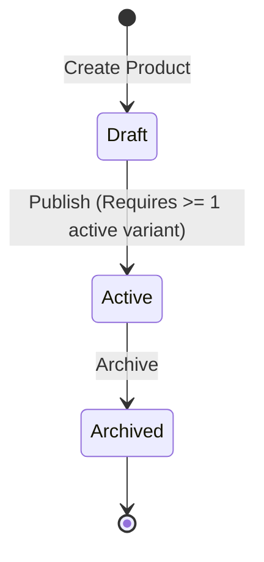

# Catalog Service Specification

## Overview
The **Catalog Service** manages product information, variants, SKUs, brands, categories, and pricing. It serves as the single source of truth for sellable goods in the e-commerce system.

### Responsibilities
* Managing brands and categories (hierarchical structures).
* Managing products and product variants.
* Storing current prices in minor units (to prevent decimal precision issues).
* Handling the product publishing lifecycle (`Draft` -> `Active` -> `Archived`).

### Boundaries & Rules
* **No Inventory Tracking**: The Catalog Service does **not** track physical stock levels, warehouses, or reservations.
* **No Cart/Order Awareness**: The Catalog Service is decoupled from shopping carts, payments, and ordering.
* **Product Snapshotting**: Other services (like Ordering) fetch product snapshots from Catalog to ensure order history remains unchanged even if Catalog price or details change later.

---

## Product Lifecycle Model


---

## Gherkin/BDD Scenarios

### Scenario 1: Creating a new product
```gherkin
Feature: Product Creation
  Scenario: Merchant creates a new product
    When the merchant creates a product with name "Super Laptop" and slug "super-laptop"
    Then the product should be saved in "Draft" status
    And the product should not be visible to customers in active listings
```

### Scenario 2: Adding variants to products
```gherkin
Feature: Product Variants
  Scenario: Merchant adds a sellable SKU variant to a product
    Given a product "Super Laptop" exists in "Draft" status
    When the merchant adds a variant with SKU "LAP-SUPER-16" priced at 129900 USD
    Then the variant should be added successfully
    And the variant price should be stored as 129900 minor units
```

### Scenario 3: Publishing products
```gherkin
Feature: Publish Product
  Scenario: Merchant publishes a product with at least one active variant
    Given a product "Super Laptop" exists in "Draft" status
    And it has an active variant "LAP-SUPER-16"
    When the merchant publishes the product
    Then the product status should become "Active"
    And it should be visible to customers in active product listings

  Scenario: Merchant attempts to publish a product with no variants
    Given a product "Empty Product" exists in "Draft" status
    And it has no variants
    When the merchant publishes the product
    Then the publish request should be rejected with a validation error
    And the product status should remain "Draft"
```

### Scenario 4: Archiving products
```gherkin
Feature: Archive Product
  Scenario: Merchant archives an active product
    Given a product "Super Laptop" exists in "Active" status
    When the merchant archives the product
    Then the product status should become "Archived"
    And the product should be excluded from active product listings
```
