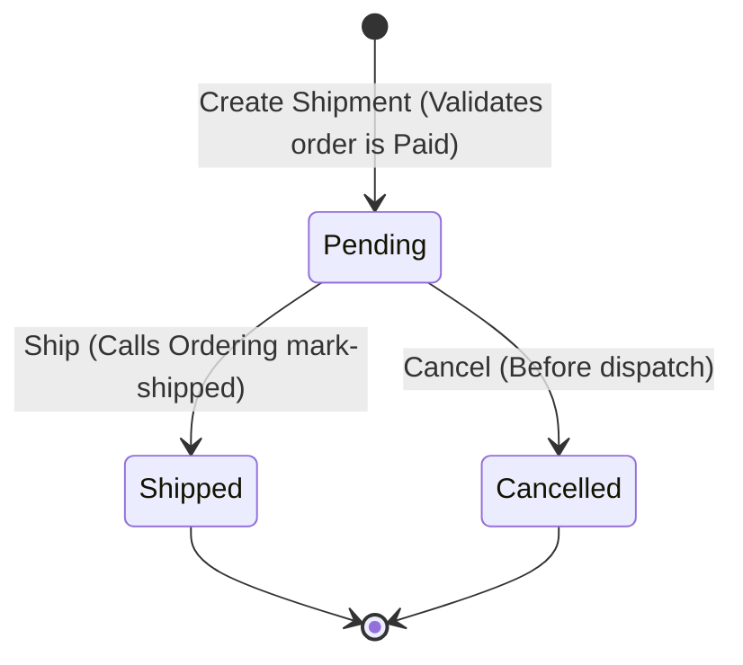

# Fulfillment Service Specification

## Overview
The **Fulfillment Service** owns the shipment lifecycle. It coordinates shipping operations for orders that have been successfully paid.

### Responsibilities
* Creating shipments in `Pending` status for paid orders.
* Registering carrier info and tracking numbers.
* Moving shipments to `Shipped` status.
* Calling the **Ordering Service** to mark the order as `Shipped` when physical dispatch is confirmed.
* Handling shipment cancellations before they are dispatched.

### Boundaries & Rules
* **Strict Order Verification**: A shipment can only be created for an existing order that is in the `Paid` status.
  * If the order does not exist or is not `Paid` (e.g. `PendingPayment`, `Cancelled`), shipment creation is rejected.
* **No Direct DB Access**: Fulfillment communicates with Ordering via API endpoints.
* **Resilience during Shippping**:
  * Shipping a shipment calls the Ordering `mark-shipped` API.
  * If Ordering rejects `mark-shipped` or fails, the shipment remains `Pending` and is not moved to the `Shipped` terminal state.
* **Lifecycle Constraints**:
  * Only `Pending` shipments can be cancelled or shipped.
  * Shipped shipments cannot be cancelled.
  * Cancelled shipments cannot be shipped.

---

## Shipment Lifecycle Model


---

## Gherkin/BDD Scenarios

### Scenario 1: Creating a Shipment
```gherkin
Feature: Create Shipment
  Scenario: Create a shipment for a Paid order
    Given the Ordering Service reports that order "ord-111" is in "Paid" status
    When a shipment is created for order "ord-111" with carrier "DHL"
    Then the shipment should be saved in "Pending" status
    And the carrier should be stored as "DHL"

  Scenario: Attempting to create a shipment for an unpaid order
    Given the Ordering Service reports that order "ord-111" is in "PendingPayment" status
    When a shipment is created for order "ord-111"
    Then the shipment creation request should be rejected
    And no shipment record should be created
```

### Scenario 2: Dispatching a Shipment (Shipping)
```gherkin
Feature: Ship Shipment
  Scenario: Confirm shipment is dispatched
    Given a shipment exists in "Pending" status for order "ord-111"
    When the shipment is shipped with tracking number "TRACK-777"
    Then the shipment status should become "Shipped"
    And the tracking number should be saved as "TRACK-777"
    And a request should be sent to Ordering to mark order "ord-111" as Shipped

  Scenario: Re-shipping an already Shipped shipment
    Given a shipment is in status "Shipped"
    When a request is made to ship it again
    Then the request should be rejected with a business validation error
```

### Scenario 3: Cancelling a Shipment
```gherkin
Feature: Cancel Shipment
  Scenario: Cancel a pending shipment before dispatch
    Given a shipment exists in "Pending" status for order "ord-111"
    When the shipment is cancelled
    Then the shipment status should become "Cancelled"
    And the order status in the Ordering Service should not be modified

  Scenario: Attempting to cancel a Shipped shipment
    Given a shipment is in status "Shipped"
    When the shipment is cancelled
    Then the cancellation request should be rejected with a business validation error
    And the shipment status should remain "Shipped"
```
