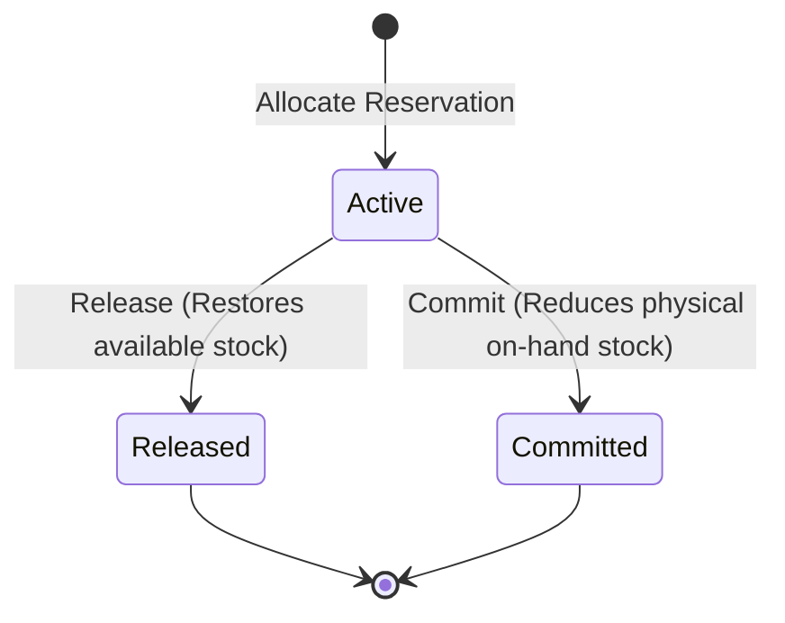

# Inventory Service Specification

## Overview
The **Inventory Service** is responsible for managing physical warehouses, storage locations, stock balances, movements, and reservations.

### Responsibilities
* Defining warehouses and storage locations.
* Managing stock balances (`on_hand_quantity`, `reserved_quantity`, and `available_quantity`).
* Recording stock movements (Receipt, Adjustment, Shipment, Reservation, Release).
* Handling stock reservations (allocating, releasing, committing).

### Boundaries & Rules
* **No Product Descriptions**: Inventory Service does **not** store catalog details like names, descriptions, or prices. It tracks stock purely by `sku`.
* **Reservation Lifecycle State-Based Idempotency**:
  * Releasing an already released/expired reservation is a no-op success.
  * Committing an already committed reservation is a no-op success.
  * Releasing a committed reservation, or committing a released reservation, results in a business error.
* **Available Quantity Check**: Stock can only be reserved if the available quantity (`on_hand_quantity - reserved_quantity`) is greater than or equal to the requested quantity.

---

## Reservation Lifecycle Model


---

## Gherkin/BDD Scenarios

### Scenario 1: Stock Receipts
```gherkin
Feature: Stock Receipt
  Scenario: Receive physical stock for a SKU
    Given warehouse "WH-MAIN" with location "A-01" has 10 units on-hand and 0 reserved for SKU "MONITOR-01"
    When 5 units of "MONITOR-01" are received at location "A-01"
    Then the stock balance for "MONITOR-01" should show 15 units on-hand
    And the reserved quantity should remain 0
    And a "Receipt" stock movement should be recorded with quantity +5
```

### Scenario 2: Allocating Reservations
```gherkin
Feature: Stock Reservation Allocation
  Scenario: Allocate stock reservation when sufficient inventory is available
    Given warehouse "WH-MAIN" with location "A-01" has 10 units on-hand and 2 reserved for SKU "MONITOR-01"
    When a reservation request is made for SKU "MONITOR-01" with quantity 5
    Then the reservation should be created in "Active" status
    And the stock balance reserved quantity should become 7 units
    And the available quantity should become 3 units
    And a "Reservation" stock movement should be recorded with quantity +5

  Scenario: Attempt to allocate stock reservation when inventory is insufficient
    Given warehouse "WH-MAIN" with location "A-01" has 5 units on-hand and 3 reserved for SKU "MONITOR-01"
    When a reservation request is made for SKU "MONITOR-01" with quantity 3
    Then the reservation request should be rejected due to insufficient stock
```

### Scenario 3: Releasing Reservations
```gherkin
Feature: Release Reservation
  Scenario: Release an active reservation
    Given an active reservation of 3 units exists for SKU "MONITOR-01" in warehouse "WH-MAIN"
    When the reservation is released
    Then the reservation status should become "Released"
    And the warehouse reserved quantity for SKU "MONITOR-01" should be reduced by 3
    And a "Release" stock movement should be recorded with quantity -3

  Scenario: Re-release an already released reservation (Retry-safety)
    Given a reservation has already been "Released"
    When a request is made to release it again
    Then the request should return success
    And no additional stock movement should be recorded
```

### Scenario 4: Committing Reservations
```gherkin
Feature: Commit Reservation
  Scenario: Commit an active reservation (Shipping)
    Given warehouse "WH-MAIN" has 10 units on-hand and 3 reserved for SKU "MONITOR-01"
    And an active reservation of 3 units exists for SKU "MONITOR-01"
    When the reservation is committed
    Then the reservation status should become "Committed"
    And the warehouse stock balance should show 7 units on-hand
    And the reserved quantity should show 0 units
    And a "Shipment" stock movement should be recorded with quantity -3

  Scenario: Re-commit an already committed reservation (Retry-safety)
    Given a reservation has already been "Committed"
    When a request is made to commit it again
    Then the request should return success
    And no additional stock movement should be recorded
```
