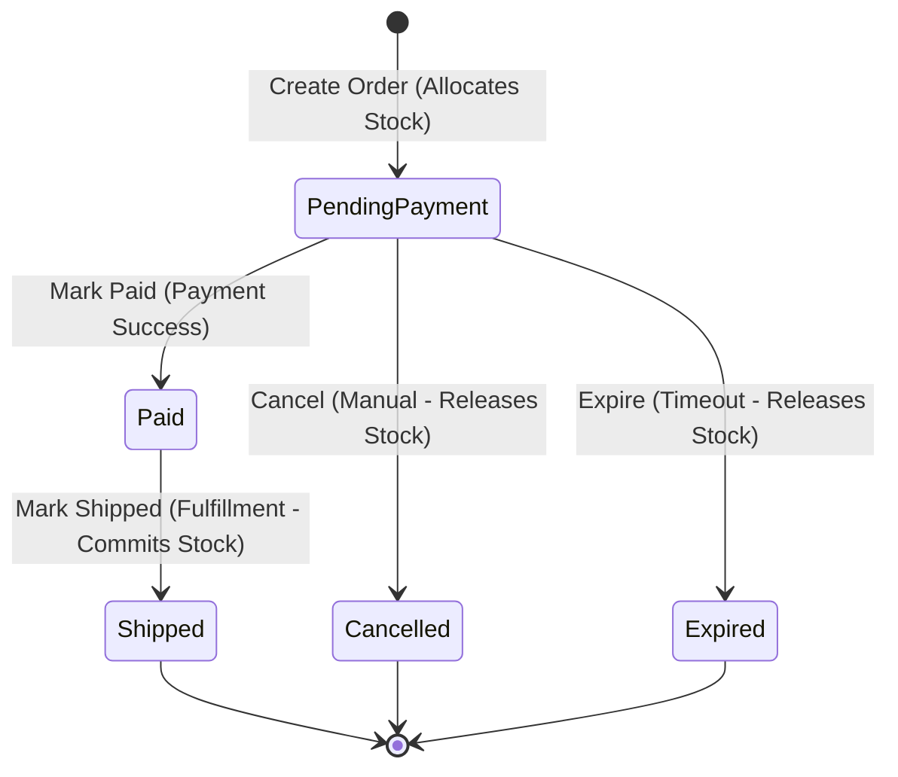

# Ordering Service Specification

## Overview
The **Ordering Service** owns the lifecycle of customer orders and represents the central coordinator for order creation, payments, and fulfillment events.

### Responsibilities
* Managing the order lifecycle (`PendingPayment` -> `Paid` -> `Shipped`, or `PendingPayment` -> `Cancelled`/`Expired`).
* Querying **Catalog Service** for trusted product snapshots (name, variant, price, currency) during checkout.
* Coordinating with **Inventory Service** to allocate stock reservations by SKU during order placement.
* Releasing stock reservations if the order is cancelled or expired.
* Triggering stock reservation commits when orders are marked as shipped.

### Boundaries & Rules
* **No Direct DB Access**: Ordering cannot access Catalog, Inventory, Payment, or Fulfillment databases directly. It integrates via synchronous API calls.
* **Pricing Snapshot Integrity**: Orders store product snapshots to isolate them from catalog modifications.
* **Resilience & State-Based Idempotency**:
  * `mark-paid`: Retry-safe. Marking an already Paid or Shipped order as Paid returns success (no-op).
  * `mark-shipped`: Retry-safe. Marking an already Shipped order as Shipped returns success (no-op). Commits the Inventory reservation.
  * `expire`: Retry-safe. Expiring an already Expired order returns success (no-op). Releases the Inventory reservation.
* **Automatic Expiration**: An internal background worker periodically expires orders that stay in `PendingPayment` longer than the configured timeout window, freeing locked stock.

---

## Order Status Transition Model


---

## Gherkin/BDD Scenarios

### Scenario 1: Order Placement
```gherkin
Feature: Create Order
  Scenario: Customer successfully places an order
    Given the Catalog Service contains variant "var-1" priced at 5000 USD
    And the Inventory Service has sufficient stock for "var-1"
    When the customer places an order for "var-1" with quantity 2
    Then a new order should be created in "PendingPayment" status
    And the order total should be calculated as 10000 minor units (50.00 USD)
    And an Inventory reservation should be allocated for SKU of "var-1"
    And the reservation ID should be saved on the order item
```

### Scenario 2: Payment Success
```gherkin
Feature: Mark Order Paid
  Scenario: Order is marked as Paid upon successful payment
    Given an order exists in "PendingPayment" status
    When the payment service calls to mark the order as Paid
    Then the order status should change to "Paid"
    And the Inventory reservation should remain allocated (not yet committed)

  Scenario: Retry marking an already Paid order (Retry-safety)
    Given an order exists in "Paid" status
    When the payment service calls to mark the order as Paid
    Then the request should return success with no status change
```

### Scenario 3: Order Shipping (Fulfillment Integration)
```gherkin
Feature: Mark Order Shipped
  Scenario: Order is marked as Shipped upon shipment
    Given an order exists in "Paid" status
    And it has an active stock reservation ID "res-999"
    When the fulfillment service calls to mark the order as Shipped
    Then the order status should change to "Shipped"
    And a request should be sent to Inventory to commit reservation "res-999"

  Scenario: Re-marking an already Shipped order (Retry-safety)
    Given an order exists in "Shipped" status
    When the fulfillment service calls to mark the order as Shipped
    Then the request should return success with no status change
```

### Scenario 4: Expiration and Cancellation
```gherkin
Feature: Order Expiration and Cancellation
  Scenario: Expire unpaid order
    Given an order exists in "PendingPayment" status
    And it has an active stock reservation ID "res-999"
    When the order is expired by the background worker or manually
    Then the order status should change to "Expired"
    And a request should be sent to Inventory to release reservation "res-999"

  Scenario: Cancel unpaid order
    Given an order exists in "PendingPayment" status
    And it has an active stock reservation ID "res-999"
    When the customer cancels the order
    Then the order status should change to "Cancelled"
    And a request should be sent to Inventory to release reservation "res-999"

  Scenario: Attempting to cancel a Paid order
    Given an order exists in "Paid" status
    When the customer attempts to cancel the order
    Then the request should be rejected with a business validation error
    And the order status should remain "Paid"

  Scenario: Attempting to create an order with an empty item list
    When a customer attempts to place an order with no items
    Then the order creation request should be rejected with a validation error

  Scenario: Attempting to create an order with mixed currencies
    Given the Catalog Service contains variant "var-1" priced in "USD"
    And the Catalog Service contains variant "var-2" priced in "EUR"
    When the customer places an order containing both "var-1" and "var-2"
    Then the order creation request should be rejected due to currency mismatch

  Scenario: Stock allocation failure during order creation
    Given the Catalog Service contains variant "var-1" priced at 5000 USD
    And the Inventory Service has 0 available units of "var-1"
    When the customer places an order for "var-1" with quantity 1
    Then the order creation request should be rejected due to insufficient stock
    And no order should be saved in the database

  Scenario: Database persistence failure after stock allocation (Rollback)
    Given the Catalog Service contains variant "var-1" priced at 5000 USD
    And the Inventory Service has sufficient stock for "var-1"
    And a stock reservation "res-111" is successfully allocated in the Inventory Service
    But saving the order details to the local database fails
    When the customer places the order
    Then the order creation should fail
    And the allocated reservation "res-111" should be automatically released in the Inventory Service

  Scenario: Attempting to expire an already Paid order
    Given an order exists in "Paid" status
    When the background worker attempts to expire the order
    Then the request should be rejected
    And the order status should remain "Paid"
```

