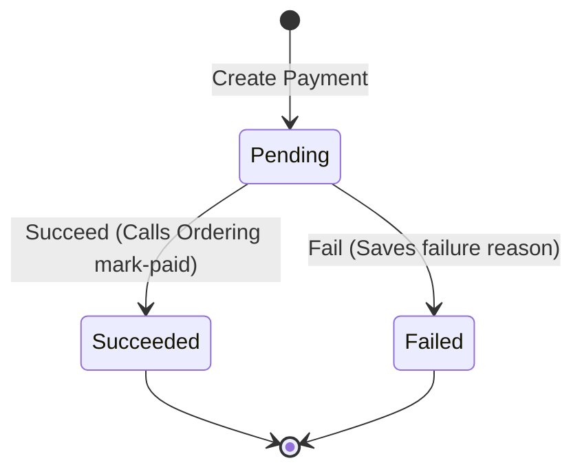

# Payment Service Specification

## Overview
The **Payment Service** is responsible for creating, tracking, and simulating transaction attempts for orders.

### Responsibilities
* Creating payment transactions in `Pending` state.
* Completing transactions (`Succeed` or `Fail`).
* Calling the **Ordering Service** to mark the order as `Paid` upon successful payment receipt.
* Storing provider-specific metadata (reference numbers, simulated gateways) and failure reasons.

### Boundaries & Rules
* **Order Ownership**: The Payment Service references orders via `order_id` but does not own the order status or logic.
* **No Direct DB Access**: The Payment Service communicates with the Ordering Service via HTTP. It does not write to `OrderingDb` or `InventoryDb`.
* **State Immutability**:
  * Once a payment is `Succeeded` or `Failed` (terminal states), it cannot be modified or reverted back to `Pending`.
  * If the Ordering Service call to `mark-paid` fails (due to network timeout/unavailability), the payment state remains `Pending` (or retryable) to prevent mismatching states between services.
* **Separation of Concerns**: Failed payments do **not** trigger any mutations in the Ordering Service. The order remains `PendingPayment` to allow the customer to retry payment using a new transaction.

---

## Payment Lifecycle Model


---

## Gherkin/BDD Scenarios

### Scenario 1: Initiating a Payment
```gherkin
Feature: Create Payment
  Scenario: Create a pending payment record
    When a payment is created for order "ord-111" of amount 10000 USD via provider "Manual"
    Then the payment record should be saved in "Pending" status
    And the amount should be stored as 10000 minor units
```

### Scenario 2: Successful Payment completion
```gherkin
Feature: Succeed Payment
  Scenario: Mark a pending payment as Succeeded
    Given a pending payment exists for order "ord-111"
    When the transaction is marked as Succeeded with provider reference "TX-9988"
    Then the payment status should become "Succeeded"
    And the provider reference should be saved as "TX-9988"
    And a request should be sent to Ordering to mark order "ord-111" as Paid

  Scenario: Attempting to succeed an already completed payment
    Given a payment for order "ord-111" is in status "Succeeded"
    When a request is made to mark the payment as Succeeded again
    Then the request should be rejected with a business validation error
```

### Scenario 3: Failed Payment completion
```gherkin
Feature: Fail Payment
  Scenario: Mark a pending payment as Failed
    Given a pending payment exists for order "ord-111"
    When the transaction is marked as Failed with reason "Insufficient Funds"
    Then the payment status should become "Failed"
    And the failure reason should be saved as "Insufficient Funds"
    And no call should be made to Ordering to update order status
```
